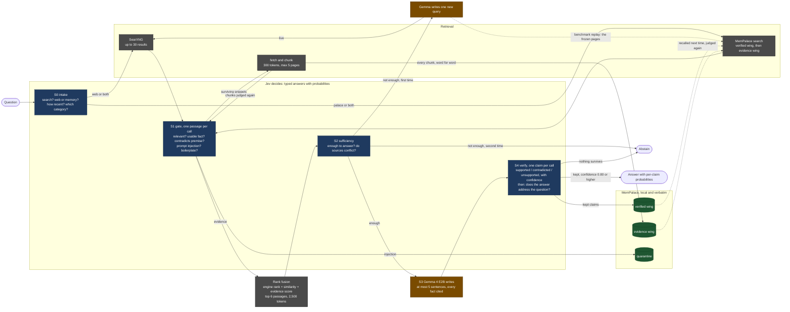

# jev-test

Can a small AI model that runs on a laptop answer questions from the web without making things up, if a separate model makes all the decisions for it? This repository is the test.

The design is written down in [docs/JUDGMENT_SPEC.md](docs/JUDGMENT_SPEC.md). The rules of the benchmark were fixed before the first run so the results cannot be tuned after the fact. Three of the seven versions now run end to end on a 20-question pilot, and the 500-question web snapshot is being frozen for the real run. This file explains the idea in plain language, shows the pilot numbers for what they are, and tells a developer what to build next.

## The problem in one paragraph

Small language models are cheap and private. A two-billion-parameter model fits in about three gigabytes of memory and runs on a normal laptop. It writes clear sentences. But when you ask it to look something up, it makes poor decisions. It searches for the wrong thing. It treats junk pages as evidence. It answers when the evidence is missing. It sometimes cites a source that says no such thing. Those failures are decisions. The writing was never the problem. The idea here is to take every decision away from the small model and give it to a model built only for decisions.

## The four pieces

| Piece | What it is | What it does here | Where it runs |
|---|---|---|---|
| Gemma 4 E2B | A small open model from Google, packaged by Unsloth | Writes the answer. Nothing else. | Your computer |
| Jev | A model from TypeSafe AI that does not write text. You give it some text and a question with fixed possible answers. It returns the answer and a probability. | Makes every decision: whether to search, which pages count, whether there is enough evidence, and whether each sentence of the answer is backed by its source. | TypeSafe's servers, through an API key |
| SearXNG | A search engine you host yourself. It asks many public search engines at once and returns the results as data. | Finds candidate web pages. | Your computer |
| MemPalace | An open memory system that stores text exactly as written and finds it again by meaning. | Keeps every page passage the system fetched, and every sentence that passed verification, so the next question can use them. | Your computer |

Jev is the only piece that is not on your machine. The design includes swappable local judges so the whole thing can run offline. See "What leaves your computer" below.

## How one question flows

1. Jev reads the question and decides four things: does this need a search, should it look at the web or at memory or both, how recent must the sources be, and which kind of search (general, news, science, technical).
2. SearXNG returns up to thirty results. MemPalace returns anything it already holds on the subject.
3. Jev looks at each result on its own and answers five yes-or-no questions: is it on topic, does it state a usable fact, does it contradict something the question assumed, is it trying to give the AI instructions, and is it mostly advertising or page furniture. Code drops, keeps, or flags each result against fixed thresholds. Code also gives each page a label such as encyclopedia, news, or forum from a short list of well-known sites; the judge sees the label but never assigns it.
4. The surviving pages, at most five, are fetched, cut into short passages, stored in MemPalace word for word, and judged again the same way. A page that fails to fetch is represented by its search snippet.
5. The best six passages are chosen by combining three rankings: the search engine's order, MemPalace's similarity score, and Jev's evidence score.
6. Jev looks at those six together and answers whether they are enough to answer the question. If not, the small model writes one alternative search and the process repeats once. In the benchmark, where the search results are frozen in advance, that second search is a second look at the same frozen pages with the new words. If there is still not enough, the system says so and stops.
7. Gemma writes an answer of at most five sentences. Every factual sentence must cite a passage by its id.
8. Jev checks each sentence against only the passages it cites and says supported, contradicted, or unsupported, with a confidence. Sentences below the bar are removed. Then Jev checks whether what is left still answers the question that was asked. If nothing is left, or the answer is about something else, the system says it could not answer.
9. Sentences that passed with high confidence are stored in MemPalace as verified memory, with their probability and the ids of the evidence they rest on. The next time a related question comes in they are candidates, and they get judged again like any other passage.

The small model touches the process in two places: step 6 (one alternative search) and step 7 (the answer).

## The same flow as a picture

Blue boxes are decisions Jev makes. Brown boxes are the only places the small model writes. Green cylinders are MemPalace. Grey is retrieval. The same diagram is saved as `docs/assets/pipeline.png` and `docs/assets/pipeline.svg` for reuse in posts, and the prompt used to draw it is in `docs/assets/pipeline-prompt.md`.



## What we measure, and what "working" means

Seven versions of the system are compared on the same questions with the same frozen search results:

| Version | Search | Judge | Writer |
|---|---|---|---|
| A | none | none | Gemma |
| B | yes, all results stuffed in, no judging | none | Gemma |
| C-laya | yes | Laya, an open decision model that runs locally | Gemma |
| C-classical | yes | older local tools: a passage ranker and a contradiction checker | Gemma |
| C-self | yes | Gemma judging itself with the same questions | Gemma |
| D | yes | Jev | Gemma |
| E | as B | none | a larger Gemma, to show what size alone buys |

The questions come from public benchmarks. SimpleQA and FreshQA cover facts found on the web. RGB and CRAG are controlled tests of noise, missing evidence, combining several sources, and false premises. Every answer is scored by a separate frontier model that plays no part in the pipeline. Jev never grades its own work.

The main score gives one point for a correct answer, zero for saying "I cannot answer", and minus one for a wrong answer. A system that knows when to stop does well on it.

Before the first run, we committed to what counts as success for version D on the web questions:

| Measure | Bar |
|---|---|
| Share of questions it attempts | at least half |
| Share of attempted answers that are wrong | at most one in ten |
| Improvement in the main score over version B | at least 0.15 |
| Share of kept sentences that the separate grader also finds supported | at least nine in ten |

We also wrote down where we expect it to fail: questions that need facts combined from several sources, and questions with a false premise. A decision model can flag a contradiction. It cannot resolve one.

A second experiment runs the same questions twice. The second pass starts with the memory the first pass built. Two bars apply: the second pass must make at most half as many judge requests per question, and its error rate must not rise by more than two points.

## Pilot results: 20 questions, a shape check and not a finding

Twenty SimpleQA questions were drawn with a fixed seed, their search results and pages were frozen on 2026-09-19, and versions A, B and D were run on the frozen set. The grader is Claude Sonnet 5 through a local gateway, with the official SimpleQA grading prompt. Intervals are bootstrap 95 percent over questions. Twenty questions give wide intervals; the point of the pilot is to check that every stage does what the spec says and to measure cost.

| Version | Correct | Wrong | Declined | Main score [95% CI] | Wrong when attempting [95% CI] | Attempted [95% CI] |
|---|---|---|---|---|---|---|
| A, generator alone | 0 | 6 | 14 | -0.30 [-0.50, -0.10] | 1.00 [1.00, 1.00] | 0.30 [0.10, 0.50] |
| B, naive search, top 8 pages | 12 | 4 | 4 | 0.40 [0.05, 0.75] | 0.25 [0.06, 0.47] | 0.80 [0.60, 0.95] |
| D, Jev decides | 15 | 0 | 5 | 0.75 [0.55, 0.95] | 0.00 [0.00, 0.00] | 0.75 [0.55, 0.95] |

Against the four bars, on this pilot only:

| Measure | Bar | Pilot value |
|---|---|---|
| Share of questions attempted | at least 0.50 | 0.75 |
| Share of attempted answers that are wrong | at most 0.10 | 0.00 |
| Improvement in the main score over version B | at least 0.15 | 0.35 |
| Share of kept sentences the grader also finds supported | at least 0.90 | 0.91 (20 of 22) |

Fifteen attempts with no wrong answer is consistent with a true error rate as high as one in five. The full run on 500 questions is what will decide it.

What the pilot cost: 979 Jev requests for 20 questions, 49 per question, about 42,000 input tokens per question, 3.5 cents in total. The spec budgeted 90 requests per question; the difference is that pages whose snippet was dropped are never fetched. Each question took about five seconds end to end on a laptop, two of them the writer's.

What the five declines were: twice the judge said the evidence was not enough even after the second search, once every sentence of the draft was stripped, and twice the checked answer did not address the question that was asked (one gave a year for the wrong event). Zero fabricated citation ids appeared in version D, against two in version B. The second search rescued one question: the first pass had judged the right page's snippet off topic, and the new query surfaced the page's own text from the frozen set.

## What leaves your computer

Version D sends to TypeSafe's servers: the question, one passage at a time (up to about 1,800 characters each), the chosen evidence block, and each sentence of the draft answer. When memory is consulted, that includes your own stored text. It does not send your identity, whole pages, or anything about your browsing. On the pilot that was about 50 requests per question.

Versions A, B, C-laya, C-classical, and C-self send nothing anywhere. Gemma, Laya, MemPalace, and a SearXNG on your own machine is a complete setup. The only outside calls are the ones SearXNG makes to public search engines.

Grading the benchmark sends questions, reference answers, evidence, and answers to the grading model's provider. That is test equipment. It is not part of the product.

## Status

| Item | State |
|---|---|
| Design and pre-registered rules | written, see [docs/JUDGMENT_SPEC.md](docs/JUDGMENT_SPEC.md) |
| Question definitions and thresholds, machine readable | written, see [judge/questions.v1.json](judge/questions.v1.json) |
| Judge client, search client, page fetching, frozen snapshots, memory helpers | done, with tests that need no network |
| Versions A, B and D | run end to end on the 20-question pilot, see [CHANGELOG.md](CHANGELOG.md) |
| The five decision stages, rank fusion, memory write-back | done, each proved with a fake judge |
| Grading: SimpleQA, citation support, the four bars | done, prompts committed under `harness/grading/prompts/` |
| 500-question SimpleQA snapshot | freezing, paced; after the first twenty questions the public search engines started refusing requests, so most questions so far hold ten results from one engine. Short questions will be re-searched once the engines recover; no headline comes from this snapshot before that. See [CHANGELOG.md](CHANGELOG.md). |
| FreshQA loader | done; the sheet holds 155 fast-changing questions, so the track uses all of them |
| Versions C-self, C-laya, C-classical, E | C-self has a working judge client, not yet run as a version; the rest are next |
| Memory experiment (second pass) | the write-back runs; the second pass is next |
| The Space | not started |

## For developers: what to build, in order

The folder layout as it stands:

```
jev-test/
  docs/JUDGMENT_SPEC.md        the design; read it first
  docs/GITHUB_SETUP.md         how the repository was put on GitHub
  docs/assets/                 the pipeline figure and the prompt that draws it
  judge/questions.v1.json      every question, criterion, and threshold; the code loads this
  harness/
    judge/
      base.py                  the Judge protocol, answer types, cache key
      http.py                  Jev, LitJev, and the Laya shim: anything speaking /v1/systemone
      adapter.py               Gemma judging itself through system-one-adapter (arm C-self)
      classical.py             bge-reranker, an NLI model, and Prompt-Guard (not written yet)
    retrieval/
      searxng.py               JSON client
      palace.py                MemPalace file, search, quarantine, flag helpers
      fetch.py                 page text and token chunks
      snapshot.py              freeze and replay
      fuse.py                  reciprocal rank fusion and the evidence caps
    generate/openai_compat.py  talks to llama-server or Unsloth Desktop
    stages/                    s0_intake.py  s1_gate.py  s2_sufficiency.py  s3_generate.py  s4_verify.py  m2_writeback.py
    arms/                      a_plain.py  b_naive.py  d_jev.py  (c_laya, c_classical, c_self, e_ceiling to come)
    grading/                   crag_score.py  simpleqa.py  claim_support.py  prereg.py  prompts/
    datasets/                  simpleqa.py  freshqa.py  loaders only, no copied data
    run.py                     --arm D --dataset simpleqa --snapshot <id>, and --grade
  tests/                       every stage against a fake judge; no network, no model
  results/                     committed JSON per arm and dataset
  snapshots/<id>/manifest.json what was searched and fetched; the palace next to it is not committed
  space/app.py                 Gradio: a leaderboard tab and a live demo tab (not started)
  docker/searxng/settings.yml  json output on, limiter off
  json_cache/                  every judge and grader response; git-ignored
```

Build order, with what is done:

1. Done. `harness/judge/base.py` and `http.py`. One call to Jev with a fixed state and question, cached to disk. Every other judge is a different base URL.
2. Done. `retrieval/searxng.py` and `retrieval/snapshot.py`. Freeze the search results and fetched pages for the whole question set into a MemPalace wing named `evidence`. Everything after this replays offline.
3. Done. Arms A and B.
4. Done. Stages S0 through S4 and the fusion step, driven by `questions.v1.json`. Then arm D.
5. In progress. Arms C-self, C-laya, and C-classical, by swapping the judge. The C-self client answers the questions through the local model; its first probabilities came back as exact zeros and ones, so the arm has not been run yet.
6. Done. Grading with the frontier model, prompts committed.
7. Half done. Stage M2 writes verified claims; the second-pass memory experiment has not run.
8. Not started. The Space, reading from `results/`.

Conventions the spec depends on: every judge response is cached by `(model, state, questions)`; thresholds are read from the JSON and never hard-coded; the pinned model id from each response is logged; nothing in the pipeline ever grades the pipeline.

## Running it

```bash
# search engine
docker compose -f docker/compose.yml up -d searxng

# writer: llama-server or Unsloth Desktop on an OpenAI-compatible port
llama-server -hf unsloth/gemma-4-E2B-it-qat-GGUF:UD-Q4_K_XL --spec-type draft-mtp -ngl 999 -fa on --port 8081

# harness
uv sync
cp .env.example .env      # then add TYPESAFE_API_KEY and the grader key
uv run pytest             # no network, no model

# freeze a snapshot, run the arms, grade
uv run python -m harness.retrieval.snapshot --dataset simpleqa --n 20 --seed 20260919 --id pilot-20260919
uv run python -m harness.run --arm A --dataset simpleqa --snapshot pilot-20260919
uv run python -m harness.run --arm B --dataset simpleqa --snapshot pilot-20260919
uv run python -m harness.run --arm D --dataset simpleqa --snapshot pilot-20260919 --limit 2   # about 130 requests, half a cent
uv run python -m harness.run --arm D --dataset simpleqa --snapshot pilot-20260919
uv run python -m harness.run --grade results/A_simpleqa_pilot-20260919.json results/B_simpleqa_pilot-20260919.json results/D_simpleqa_pilot-20260919.json
```

The grade step prints the score table and, for version D, the four bars labelled with the snapshot, so a pilot always reads as a pilot.

## Sources

The design leans on published work instead of guesses. The full list with dates is in section 14 of the spec. The ones that shaped it most:

- TypeSafe's cookbooks for classifying retrieved passages, re-ranking, and checking citations. They supply the questions and thresholds used here.
- TypeSafe's page on Jev's known failure modes. It supplies the design rules.
- OpenRouter's Jev-verified cascade recipe (September 2026).
- An independent 9,831-pair evaluation showing that Jev on its own does not beat a good embedding ranker, while Jev combined with one does. That is why the ranking step combines scores.
- Chen et al. (AAAI 2024) and Yang et al. (NeurIPS 2024) for the benchmark tasks and the scoring.
- MemPalace's documentation for the memory layer.

## License

MIT for this repository. Gemma 4 is Apache 2.0. Laya is Apache 2.0. MemPalace is MIT. Jev is a hosted service with its own terms. Benchmark datasets keep their own licenses and are downloaded at run time, never copied here.
