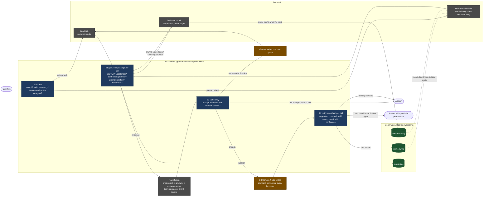

# jev-test

Can a small AI model that runs on a laptop answer questions from the web without making things up, if a separate model makes all the decisions for it? This repository is the test.

Nothing runs yet. The design is finished and written down in [docs/JUDGMENT_SPEC.md](docs/JUDGMENT_SPEC.md). The rules of the benchmark are fixed before the first run so the results cannot be tuned after the fact. This file explains the idea in plain language and tells a developer what to build, in what order.

## The problem in one paragraph

Small language models are cheap and private. A two-billion-parameter model fits in about three gigabytes of memory and runs on a normal laptop. It writes clear sentences. But when you ask it to look something up, it makes poor decisions. It searches for the wrong thing. It treats junk pages as evidence. It answers when the evidence is missing. It sometimes cites a source that says no such thing. Those failures are decisions. The writing was never the problem. The idea here is to take every decision away from the small model and give it to a model built only for decisions.

## The four pieces

| Piece | What it is | What it does here | Where it runs |
|---|---|---|---|
| Gemma 4 E2B | A small open model from Google, packaged by Unsloth | Writes the answer. Nothing else. | Your computer |
| Jev | A model from TypeSafe AI that does not write text. You give it some text and a question with fixed possible answers. It returns the answer and a probability. | Makes every decision: whether to search, which pages count, whether there is enough evidence, and whether each sentence of the answer is backed by its source. | TypeSafe's servers, through an API key |
| SearXNG | A search engine you host yourself. It asks many public search engines at once and returns the results as data. | Finds candidate web pages. | Your computer |
| MemPalace | An open memory system that stores text exactly as written and finds it again by meaning. | Keeps every page passage the system fetched, and every sentence that passed verification, so the next question can use them. | Your computer |

Jev is the only piece that is not on your machine. The design includes swappable local judges so the whole thing can run offline. See "What leaves your computer" below.

## How one question flows

1. Jev reads the question and decides four things: does this need a search, should it look at the web or at memory or both, how recent must the sources be, and which kind of search (general, news, science, technical).
2. SearXNG returns up to thirty results. MemPalace returns anything it already holds on the subject.
3. Jev looks at each result on its own and answers five yes-or-no questions: is it on topic, does it state a usable fact, does it contradict something the question assumed, is it trying to give the AI instructions, and is it mostly advertising or page furniture. Code drops, keeps, or flags each result against fixed thresholds.
4. The surviving pages are fetched, cut into short passages, stored in MemPalace word for word, and judged again the same way.
5. The best six passages are chosen by combining three rankings: the search engine's order, MemPalace's similarity score, and Jev's evidence score.
6. Jev looks at those six together and answers whether they are enough to answer the question. If not, the small model writes one alternative search and the process repeats once. If there is still not enough, the system says so and stops.
7. Gemma writes an answer of at most five sentences. Every factual sentence must cite a passage by its id.
8. Jev checks each sentence against only the passages it cites and says supported, contradicted, or unsupported, with a confidence. Sentences below the bar are removed. If nothing is left, the system says it could not answer.
9. Sentences that passed with high confidence are stored in MemPalace as verified memory, with their probability and the ids of the evidence they rest on. The next time a related question comes in they are candidates, and they get judged again like any other passage.

The small model touches the process in two places: step 6 (one alternative search) and step 7 (the answer).

## The same flow as a picture

Blue boxes are decisions Jev makes. Brown boxes are the only places the small model writes. Green cylinders are MemPalace. Grey is retrieval. The same diagram is saved as `docs/assets/pipeline.png` and `docs/assets/pipeline.svg` for reuse in posts.



## What we measure, and what "working" means

Seven versions of the system are compared on the same questions with the same frozen search results:

| Version | Search | Judge | Writer |
|---|---|---|---|
| A | none | none | Gemma |
| B | yes, all results stuffed in, no judging | none | Gemma |
| C-laya | yes | Laya, an open decision model that runs locally | Gemma |
| C-classical | yes | older local tools: a passage ranker and a contradiction checker | Gemma |
| C-self | yes | Gemma judging itself with the same questions | Gemma |
| D | yes | Jev | Gemma |
| E | as B | none | a larger Gemma, to show what size alone buys |

The questions come from public benchmarks. SimpleQA and FreshQA cover facts found on the web. RGB and CRAG are controlled tests of noise, missing evidence, combining several sources, and false premises. Every answer is scored by a separate frontier model that plays no part in the pipeline. Jev never grades its own work.

The main score gives one point for a correct answer, zero for saying "I cannot answer", and minus one for a wrong answer. A system that knows when to stop does well on it.

Before the first run, we commit to what counts as success for version D on the web questions:

| Measure | Bar |
|---|---|
| Share of questions it attempts | at least half |
| Share of attempted answers that are wrong | at most one in ten |
| Improvement in the main score over version B | at least 0.15 |
| Share of kept sentences that the separate grader also finds supported | at least nine in ten |

We also write down where we expect it to fail: questions that need facts combined from several sources, and questions with a false premise. A decision model can flag a contradiction. It cannot resolve one.

A second experiment runs the same questions twice. The second pass starts with the memory the first pass built. Two bars apply: the second pass must make at most half as many judge requests per question, and its error rate must not rise by more than two points.

## What leaves your computer

Version D sends to TypeSafe's servers: the question, one passage at a time (up to about 1,800 characters each), the chosen evidence block, and each sentence of the draft answer. When memory is consulted, that includes your own stored text. It does not send your identity, whole pages, or anything about your browsing.

Versions A, B, C-laya, C-classical, and C-self send nothing anywhere. Gemma, Laya, MemPalace, and a SearXNG on your own machine is a complete setup. The only outside calls are the ones SearXNG makes to public search engines.

Grading the benchmark sends questions, reference answers, evidence, and answers to the grading model's provider. That is test equipment. It is not part of the product.

## Status

| Item | State |
|---|---|
| Design and pre-registered rules | written, see [docs/JUDGMENT_SPEC.md](docs/JUDGMENT_SPEC.md) |
| Question definitions and thresholds, machine readable | written, see [judge/questions.v1.json](judge/questions.v1.json) |
| Code | not started; the folder layout and one interface stub exist |
| Results | none yet. This section fills in after the first pre-registered run. |

## For developers: what to build, in order

The folder layout the spec expects:

```
jev-test/
  docs/JUDGMENT_SPEC.md        the design; read it first
  docs/GITHUB_SETUP.md         how the repository was put on GitHub
  judge/questions.v1.json      every question, criterion, and threshold; the code loads this
  harness/
    judge/
      base.py                  the Judge protocol and answer types (stub provided)
      http.py                  Jev, LitJev, and the Laya shim: anything speaking /v1/systemone
      adapter.py               Gemma judging itself through system-one-adapter
      classical.py             bge-reranker, an NLI model, and Prompt-Guard
    retrieval/
      searxng.py               JSON client
      palace.py                MemPalace file, search, and quarantine helpers
      snapshot.py              freeze and replay
      fuse.py                  reciprocal rank fusion
    generate/openai_compat.py  talks to llama-server or Unsloth Desktop
    stages/                    s0_intake.py  s1_gate.py  s2_sufficiency.py  s3_generate.py  s4_verify.py  m2_writeback.py
    arms/                      a_plain.py  b_naive.py  c_laya.py  c_classical.py  c_self.py  d_jev.py  e_ceiling.py
    grading/                   crag_score.py  simpleqa.py  claim_support.py  prompts/
    datasets/                  loaders only, no copied data
    run.py                     --arm D --dataset simpleqa --snapshot <id>
  results/                     committed JSON per arm and dataset
  space/app.py                 Gradio: a leaderboard tab and a live demo tab
  docker/searxng/settings.yml  json output on, limiter off
  json_cache/                  every judge response, keyed by (model, state, questions); git-ignored
```

Build in this order. Each step is testable on its own.

1. `harness/judge/base.py` and `http.py`. One call to Jev with a fixed state and question, cached to disk. This is the load-bearing abstraction. Every other judge is a different base URL.
2. `retrieval/searxng.py` and `retrieval/snapshot.py`. Freeze the search results and fetched pages for the whole question set into a MemPalace wing named `evidence`. Everything after this replays offline.
3. Arms A and B. No judge needed. These are the baselines, and they produce numbers on day one.
4. Stages S0 through S4 and the fusion step, driven by `questions.v1.json`. Then arm D.
5. Arms C-laya, C-self, and C-classical, by swapping the judge.
6. Grading with the frontier model. Commit the prompts.
7. Stage M2 and the memory experiment.
8. The Space, reading from `results/`.

Conventions the spec depends on: every judge response is cached by `(model, state, questions)`; thresholds are read from the JSON and never hard-coded; the pinned model id from each response is logged; nothing in the pipeline ever grades the pipeline.

## Running it (planned, not yet implemented)

```bash
# search engine
docker compose -f docker/compose.yml up -d searxng

# writer
llama-server -hf unsloth/gemma-4-E2B-it-qat-GGUF:UD-Q4_K_XL --spec-type draft-mtp -ngl 999 -fa on --port 8081

# memory
uv tool install mempalace

# harness
uv sync
cp .env.example .env      # then add TYPESAFE_API_KEY
uv run python -m harness.run --arm B --dataset simpleqa --snapshot 2026-09-xx
```

## Sources

The design leans on published work instead of guesses. The full list with dates is in section 14 of the spec. The ones that shaped it most:

- TypeSafe's cookbooks for classifying retrieved passages, re-ranking, and checking citations. They supply the questions and thresholds used here.
- TypeSafe's page on Jev's known failure modes. It supplies the design rules.
- OpenRouter's Jev-verified cascade recipe (September 2026).
- An independent 9,831-pair evaluation showing that Jev on its own does not beat a good embedding ranker, while Jev combined with one does. That is why the ranking step combines scores.
- Chen et al. (AAAI 2024) and Yang et al. (NeurIPS 2024) for the benchmark tasks and the scoring.
- MemPalace's documentation for the memory layer.

## License

MIT for this repository. Gemma 4 is Apache 2.0. Laya is Apache 2.0. MemPalace is MIT. Jev is a hosted service with its own terms. Benchmark datasets keep their own licenses and are downloaded at run time, never copied here.
