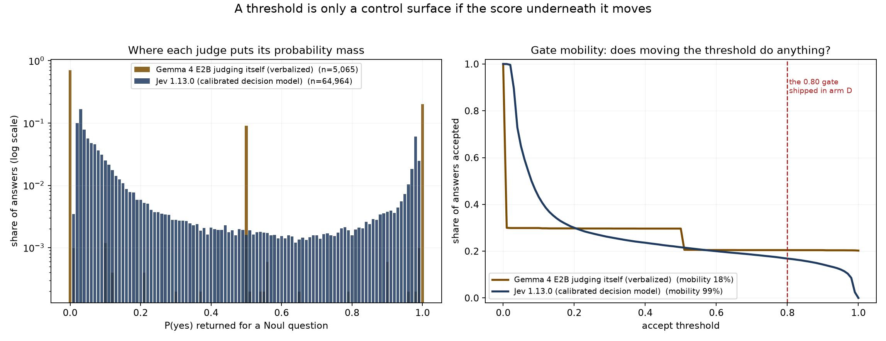

# jev-test

Can a small AI model that runs on a laptop answer questions from the web without making things up, if a separate model makes all the decisions for it? This repository is the test. On 500 questions the judged version cleared three of its four pre-registered bars and missed the one that mattered most: it scored 0.612, below the 0.740 from doing no judging at all. The cause was the search results, not the judge.

The rules were fixed before the first run, in [docs/JUDGMENT_SPEC.md](docs/JUDGMENT_SPEC.md). The long version of this page, with the pipeline diagram, the 20-question pilot and the developer notes, is in [docs/DESIGN.md](docs/DESIGN.md).

## The problem in one paragraph

Small language models are cheap and private. A two-billion-parameter model fits in about three gigabytes of memory and runs on a normal laptop. It writes clear sentences. But when you ask it to look something up, it makes poor decisions. It searches for the wrong thing. It treats junk pages as evidence. It answers when the evidence is missing. It sometimes cites a source that says no such thing. Those failures are decisions. The writing was never the problem. The idea here is to take every decision away from the small model and give it to a model built only for decisions.

Gemma 4 E2B writes the answers. TypeSafe's Jev (`jev-1.13.0`) decides whether to search, which pages count, whether there is enough evidence, and whether each sentence is backed by the passage it cites. SearXNG finds the pages and MemPalace stores them.

## Results on 500 questions

500 SimpleQA questions, drawn with seed 20260919. Search results and page text were frozen on 2026-09-19, so every version saw the same pages. A right answer scores +1, declining scores 0, and a wrong answer scores -1, so a system that knows when to stop does well. The grader is Claude Sonnet 5 with the official SimpleQA prompt. Intervals are bootstrap 95 percent over questions.

| Version | Correct | Wrong | Declined | Main score [95% CI] | Attempted |
|---|---|---|---|---|---|
| A, the small model alone | 6 | 153 | 341 | -0.294 [-0.340, -0.254] | 31.8% |
| B, top 8 pages, no judge | 407 | 37 | 56 | 0.740 [0.688, 0.792] | 88.8% |
| D, Jev makes every decision | 332 | 26 | 142 | 0.612 [0.562, 0.662] | 71.6% |

The four bars set for version D before the run, as scored by `harness/grading/prereg.py`:

| Bar | Rule | Observed [95% CI] | Result |
|---|---|---|---|
| Share of questions attempted | at least 0.50 | 0.716 [0.676, 0.756] | clears |
| Share of attempted answers that are wrong | at most 0.10 | 0.073 [0.047, 0.101] | clears |
| Main score gain over version B | at least 0.15 | -0.128 | misses |
| Kept sentences the grader finds supported | at least 0.90 | 0.982 [0.972, 0.992] | clears |

The wrong-answer bar clears on the point estimate, but the top of its interval sits at 0.101. Version B's wrong-answer rate is 0.083 [0.057, 0.108], and the two intervals overlap, so this run shows no difference between them on that measure.

Version D cost $0.53 for 13,974 judge requests, 27.9 per question.

## Why the judged version lost

Version D declined 142 questions against B's 56. On the 44 it declined because its final check removed every sentence, B answered 38 correctly and 1 wrongly. That looked like the 0.80 confidence gate throwing away good answers, so `scripts/gate_replay.py` replays the gate at every threshold.

The gate was not the cause. Only 94 of the 172 removed sentences can come back by moving the threshold; the rest were removed for their label (unsupported, contradicted, no citation, or a citation to a passage that does not exist), and no threshold touches those. Moving the gate all the way to 0.00 recovers 46 questions and reaches 0.688 at most, which is still below B. Raising it does not help either: the wrong-sentence rate among kept sentences goes from 1.77% to 0.83% while the share kept falls to 57.9%. The gate explains at most 0.076 of the 0.128 gap.

The rest is retrieval depth, which this file warned about before the run. While the pages were being frozen, the local search instance lost most of its engines to rate limits and CAPTCHAs, so the 500 questions average 10.7 search results each against the pilot's 28.7. Version D fetches at most 5 pages from what survives its first filter, and with a third as many candidates it ran short of evidence. Version B reads the top 8 pages and stops, so it barely noticed.

The replay's numbers below 0.80 use version B's grade on the same question as a stand-in, so they are an upper bound. The 94 sentences that would need grading to replace them are in `results/gate_replay_worklist.jsonl`.

## What held up

The final check worked. 612 of the 623 sentences it kept were supported by their citations (0.982). That count only covers sentences the pipeline chose to keep, across 365 of the 500 questions, so it is not an accuracy figure for the whole pipeline.

The judge's confidence also works as a control, which is the finding worth reusing. On the 20-question pilot the same pipeline ran with Gemma judging its own work, answering the same questions about the same passages. On the 3,885 judgments both judges made:



| Same passage, same question (n=3,885) | Gemma judging itself | Jev |
|---|---|---|
| Agree on the yes/no call at 0.5 | 82.8% | |
| Share of answers on its three most common values | 99.6% | 34.4% |
| Gate mobility | 11% | 99% |

Gate mobility is the share of 0.01 threshold steps, from 0 to 1, that change which answers get through. At 11%, 89% of the thresholds you could set on Gemma's score give the same result as the one beside them, because its answers sit on 0.00, 1.00 and 0.50. Gemma usually makes the right call; it cannot say how sure it is. A threshold on that score does nothing. The statistics are published at <https://huggingface.co/datasets/clduab11/jev-calibration-statistics>.

The Gemma arm used verbalized confidence: it is asked how sure it is and the number is read back. That is the weakest way to get a probability from a small model. Token logprobs and self-consistency vote fractions cost nothing and are likely much better, and neither has been run here. This is not evidence that local models cannot be calibrated.

## A grader bug, fixed before the 500-question grading

During development the grader ran with an 8-token output cap. The grading model reasons for about 120 tokens before it writes its one-word verdict, so replies came back empty and the parser counted them as unsupported. The cap was raised, an unreadable reply became its own label that is left out of the rate instead of counted against it, and `tests/test_claim_support.py` pins that behaviour. On the pilot, re-grading moved the self-judge's citation support from 0.704 to 0.926 and left Jev's 0.909 unchanged. The fix landed before the 500-question grading ran, and that run reports 0 unreadable replies.

## What this does not show

- One dataset, one frozen snapshot, and a thin one. A deeper snapshot could change the ranking of B and D.
- Every correctness number is agreement with another model. No person graded anything.
- The calibration comparison covers 21 questions. The 3,885 judgments are many passages per question and move together within a question.
- Citation support rewards careful citing, not correct answers. On the pilot the self-judge scored 0.926 on it against Jev's 0.909 while answering fewer questions correctly, because it cited carefully and answered neighbouring questions.

## What leaves your computer

Version D sends to TypeSafe's servers: the question, one passage at a time (up to about 1,800 characters each), the chosen evidence block, and each sentence of the draft answer. When memory is consulted, that includes your own stored text. It does not send your identity, whole pages, or anything about your browsing. On the pilot that was about 50 requests per question. TypeSafe may keep what it receives, so treat anything sent to the judge as shared with them.

Versions A, B, C-laya, C-classical, and C-self send nothing anywhere. Gemma, Laya, MemPalace, and a SearXNG on your own machine is a complete setup. The only outside calls are the ones SearXNG makes to public search engines.

Grading the benchmark sends questions, reference answers, evidence, and answers to the grading model's provider. That is test equipment. It is not part of the product.


## Status

| Item | State |
|---|---|
| Design and pre-registered rules | written, [docs/JUDGMENT_SPEC.md](docs/JUDGMENT_SPEC.md) |
| Questions, criteria and thresholds | [judge/questions.v1.json](judge/questions.v1.json), loaded by the code |
| Versions A, B and D on 500 SimpleQA questions | run and graded, in `results/` |
| Gate replay | done, `results/gate_replay.json`; its 94 rescued sentences are not yet graded |
| Calibration statistics | published on Hugging Face; the raw judge records stay local under TypeSafe's terms |
| Version C-self | run on the 20-question pilot only |
| Versions C-laya, C-classical and E | not run |
| FreshQA track | loader done, not run |
| Memory experiment (second pass) | write-back runs; the second pass has not |
| The Space | not started |

What to run next, in order:

1. Grade the 94 sentences in `results/gate_replay_worklist.jsonl`, so the replay below 0.80 is measured instead of bounded.
2. Add two local judges that give graded confidence without a paid API: constrained decoding with token logprobs, and self-consistency over 10 samples. If either reaches Jev's gate mobility, the calibration finding is about verbalized confidence alone.
3. Freeze a deeper snapshot and run B and D again, to test whether retrieval depth is the whole story.

## Running it

```bash
# search engine
docker compose -f docker/compose.yml up -d searxng

# writer: llama-server or Unsloth Desktop on an OpenAI-compatible port
llama-server -hf unsloth/gemma-4-E2B-it-qat-GGUF:UD-Q4_K_XL --spec-type draft-mtp -ngl 999 -fa on --port 8081

# harness
uv sync
cp .env.example .env      # then add TYPESAFE_API_KEY and the grader key
uv run pytest             # no network, no model

# freeze a snapshot, run the arms, grade
uv run python -m harness.retrieval.snapshot --dataset simpleqa --n 20 --seed 20260919 --id pilot-20260919
uv run python -m harness.run --arm A --dataset simpleqa --snapshot pilot-20260919
uv run python -m harness.run --arm B --dataset simpleqa --snapshot pilot-20260919
uv run python -m harness.run --arm D --dataset simpleqa --snapshot pilot-20260919 --limit 2   # about 130 requests, half a cent
uv run python -m harness.run --arm D --dataset simpleqa --snapshot pilot-20260919
uv run python -m harness.run --grade results/A_simpleqa_pilot-20260919.json results/B_simpleqa_pilot-20260919.json results/D_simpleqa_pilot-20260919.json
```

The grade step prints the score table and, for a judged version, the four bars labelled with the snapshot, so a pilot always reads as a pilot. To run the whole web track unattended (finish the freeze, re-search short questions when engines allow it, run A, B and D, grade):

```bash
uv run --with "system-one-adapter[openai]>=0.2.0" python scripts/run_web_track.py --snapshot simpleqa-500-20260919 --n 500 --cself-pilot
```


## More

- [docs/DESIGN.md](docs/DESIGN.md): how one question flows, the pipeline diagram, what each version is, the 20-question pilot and its ablation, the developer build order, and the sources the design leans on.
- [docs/JUDGMENT_SPEC.md](docs/JUDGMENT_SPEC.md): the full design and pre-registered rules.
- `scripts/export_corpus.py`, `scripts/calibration_figure.py` and `scripts/gate_replay.py` rebuild every number in this file from `json_cache/` and `results/`.

## License

MIT for this repository. Gemma 4 is Apache 2.0. Laya is Apache 2.0. MemPalace is MIT. Jev is a hosted service with its own terms. Benchmark datasets keep their own licenses and are downloaded at run time, never copied here.
