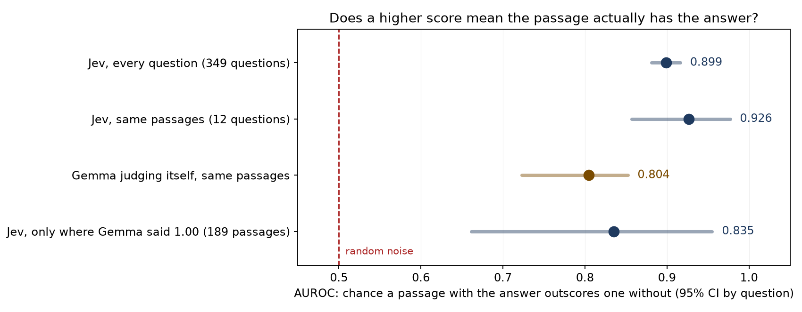

# Confidence statistics for Jev and a self-judging Gemma 4 E2B

Aggregate statistics on the confidence scores from two judges in a retrieval benchmark: TypeSafe's Jev, pinned to `jev-1.13.0`, and Gemma 4 E2B judging its own work.

End to end, the pipeline with Jev making every decision did not beat the same pipeline with no judge: it scored 0.612 against 0.740, missed its main pre-registered bar, made about the same number of mistakes on questions both answered, and lost because it declined far more questions. Details are in the [repo](https://github.com/clduab11/jev-test).

## Jev's score tracks whether a passage holds the answer

Jev was asked `contains_answer_evidence` ("does this passage contain evidence that answers the question?") for each passage. The label uses no model: a passage is positive when the gold answer string appears in its text. Golds of 4 characters or fewer are dropped because short strings match pages for unrelated reasons.

Across 9,075 passages from 349 questions, Jev's AUROC is 0.899 [0.881, 0.916]. Random scores sit at 0.5. With golds longer than 7 characters only (8,056 passages) it is 0.902. Measured within each question, pair-weighted, it is 0.925.

## Jev ranks passages better than Gemma judging itself

On the 20-question pilot the pipeline also ran with Gemma judging its own work on the same passages. Gemma's confidence is verbalized: it is asked how sure it is and the number is read back.

The paired set is 473 passages from 12 questions. Jev's AUROC is 0.926 [0.857, 0.977] and Gemma's is 0.804 [0.723, 0.852]. The difference is +0.122 [+0.046, +0.199].

The sample is small: 90 answer-bearing passages across 9 questions, with 5 questions holding 82 of them. A percentile bootstrap over 12 clusters runs narrow, so treat those intervals as approximate. Leaving out one question at a time, the difference stays between +0.108 and +0.158. A jackknife 95% interval is about [+0.025, +0.220].

Of the 189 passages Gemma marked 1.00, fully certain, only 40% (76) contain the gold answer string. Jev's score still separates them: AUROC 0.835 [0.662, 0.955]. Only 7 of the 12 questions have both kinds of passage in that group; leaving out one question at a time gives 0.814 to 0.909.

## Gemma's scores give a threshold nothing to hold

Both models made the same 3,885 judgments across 21 questions (the pilot plus one smoke-test question). They agree on the yes/no call at 0.5 in 82.8% of cases.

| Same judgments (n=3,885, 21 questions) | Gemma 4 E2B (verbalized) | `jev-1.13.0` |
|---|---|---|
| Distinct values | 12 | 99 |
| Share on its top 3 values | 99.6% | 34.4% |
| Share between 0.10 and 0.90 | 6.3% | 30.3% |
| Gate mobility | 11% | 99% |

Gemma's top values are 0.00, 1.00 and 0.50. Gate mobility is the share of 0.01 threshold steps from 0.00 to 0.99 that change which answers pass. It equals the count of distinct values below 1.00 on a 0.01 grid, divided by 100, so uniform random noise scores near 100% on it. Mobility shows whether a threshold can move and says nothing about whether moving it helps. The AUROC results above are the evidence; this table is the explanation.

## Files

`noul_histogram.csv` is the viewer table: paired histograms, one row per model and probability value, with a count. `statistics.json` has per-model counts, stages, question ids, and paired and unpaired histograms; the unpaired totals (Gemma 5,065 answers, Jev 64,964) cover different questions, so do not compare them. `calibration_metrics.json` holds the spread table and `informativeness.json` the AUROC results. `calibration.png`/`.svg` and `informativeness.png`/`.svg` are the figures.

The spread table rebuilds from `statistics.json` with `scripts/calibration_figure.py`. The AUROC results come from `scripts/informativeness.py` over the raw records, which stay local.

## Limitations

- Gemma's confidence was verbalized. Token logprobs and vote fractions over 10 samples were not tried, so this says nothing about those methods.
- The Gemma comparison rests on 12 questions (AUROC) and 21 (spread). Passages within a question are correlated.
- The answer-string label misses answers phrased differently from the gold and can fire on a common gold word that appears for unrelated reasons.
- All passages are English web text from one dataset (SimpleQA), frozen on 2026-09-19 in two snapshots: the 20-question pilot and the 500-question run.

## What is not included and why

The raw records of state, question and probability stay local: 67,312 from Jev and 5,159 from Gemma. TypeSafe's [customer agreement](https://typesafe.ai/legal/mca) assigns ownership of output to the customer in §4.2, so the records are mine. Its §2.3(b) bars using output to "perform model distillation, train a model to imitate the output of the Services, or ... facilitate the development of a similar or competing product or service." The `state` field also holds text copied from third-party web pages (§2.3(l)). Aggregate statistics carry neither problem.

## Provenance

500 SimpleQA questions drawn with seed 20260919; search results and page text frozen 2026-09-19. The judge is pinned to `jev-1.13.0`, never the moving `jev-latest` alias. Intervals are 95%, bootstrapped over questions (1,000 resamples).

Code and per-question results: <https://github.com/clduab11/jev-test>

MIT.
