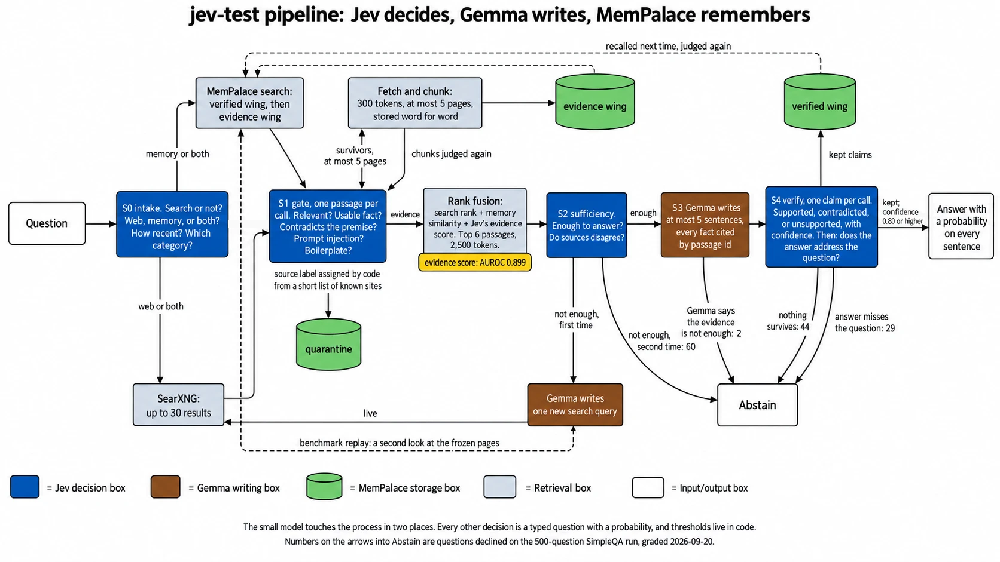
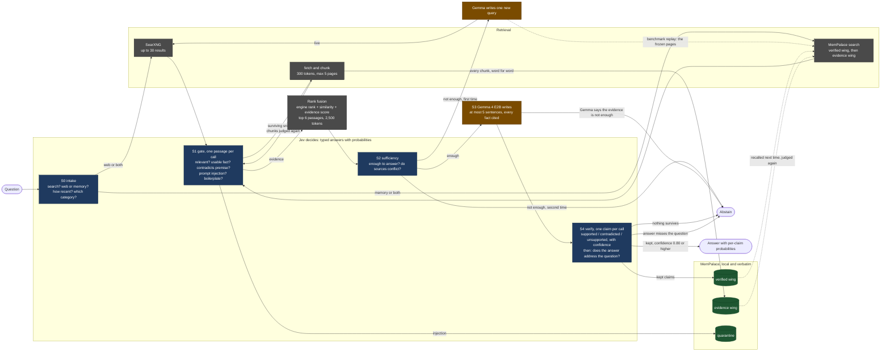

# jev-test: design, pilot findings, and developer notes

This is the long version. The results and how to run it are in the [README](../README.md).

## The four pieces

| Piece | What it is | What it does here | Where it runs |
|---|---|---|---|
| Gemma 4 E2B | A small open model from Google, packaged by Unsloth | Writes the answer. Nothing else. | Your computer |
| Jev | A model from TypeSafe AI that does not write text. You give it some text and a question with fixed possible answers. It returns the answer and a probability. | Makes every decision: whether to search, which pages count, whether there is enough evidence, and whether each sentence of the answer is backed by its source. | TypeSafe's servers, through an API key |
| SearXNG | A search engine you host yourself. It asks many public search engines at once and returns the results as data. | Finds candidate web pages. | Your computer |
| MemPalace | An open memory system that stores text exactly as written and finds it again by meaning. | Keeps every page passage the system fetched, and every sentence that passed verification, so the next question can use them. | Your computer |

Jev is the only piece that is not on your machine. The design includes swappable local judges so the whole thing can run offline. See "What leaves your computer" below.

## How one question flows

1. Jev reads the question and decides four things: does this need a search, should it look at the web or at memory or both, how recent must the sources be, and which kind of search (general, news, science, technical).
2. SearXNG returns up to thirty results. MemPalace returns anything it already holds on the subject.
3. Jev looks at each result on its own and answers five yes-or-no questions: is it on topic, does it state a usable fact, does it contradict something the question assumed, is it trying to give the AI instructions, and is it mostly advertising or page furniture. Code drops, keeps, or flags each result against fixed thresholds. Code also gives each page a label such as encyclopedia, news, or forum from a short list of well-known sites; the judge sees the label but never assigns it.
4. The surviving pages, at most five, are fetched, cut into short passages, stored in MemPalace word for word, and judged again the same way. A page that fails to fetch is represented by its search snippet.
5. The best six passages are chosen by combining three rankings: the search engine's order, MemPalace's similarity score, and Jev's evidence score.
6. Jev looks at those six together and answers whether they are enough to answer the question. If not, the small model writes one alternative search and the process repeats once. In the benchmark, where the search results are frozen in advance, that second search is a second look at the same frozen pages with the new words. If there is still not enough, the system says so and stops.
7. Gemma writes an answer of at most five sentences. Every factual sentence must cite a passage by its id.
8. Jev checks each sentence against only the passages it cites and says supported, contradicted, or unsupported, with a confidence. Sentences below the bar are removed. Then Jev checks whether what is left still answers the question that was asked. If nothing is left, or the answer is about something else, the system says it could not answer.
9. Sentences that passed with high confidence are stored in MemPalace as verified memory, with their probability and the ids of the evidence they rest on. The next time a related question comes in they are candidates, and they get judged again like any other passage.

The small model touches the process in two places: step 6 (one alternative search) and step 7 (the answer).

## The same flow as a picture

Blue boxes are decisions Jev makes. Brown boxes are the only places the small model writes. Green cylinders are MemPalace. Grey is retrieval. The drawn version below is `docs/assets/pipeline.png`, made from the prompt in `docs/assets/pipeline-prompt.md`; the Mermaid source after it is the ground truth.



The numbers on the exits to Abstain are from the 500-question run: the pipeline declined 135 questions (60 at S2, 2 at S3, 44 and 29 at S4) and answered 365. The grader scored 7 of those 365 answers as not attempted, which is where the README's total of 142 comes from.



## What we measure, and what "working" means

Seven versions of the system are compared on the same questions with the same frozen search results:

| Version | Search | Judge | Writer |
|---|---|---|---|
| A | none | none | Gemma |
| B | yes, all results stuffed in, no judging | none | Gemma |
| C-laya | yes | Laya, an open decision model that runs locally | Gemma |
| C-classical | yes | older local tools: a passage ranker and a contradiction checker | Gemma |
| C-self | yes | Gemma judging itself with the same questions | Gemma |
| D | yes | Jev | Gemma |
| E | as B | none | a larger Gemma, to show what size alone buys |

The questions come from public benchmarks. SimpleQA and FreshQA cover facts found on the web. RGB and CRAG are controlled tests of noise, missing evidence, combining several sources, and false premises. Every answer is scored by a separate frontier model that plays no part in the pipeline. Jev never grades its own work.

The main score gives one point for a correct answer, zero for saying "I cannot answer", and minus one for a wrong answer. A system that knows when to stop does well on it.

Before the first run, we committed to what counts as success for version D on the web questions:

| Measure | Bar |
|---|---|
| Share of questions it attempts | at least half |
| Share of attempted answers that are wrong | at most one in ten |
| Improvement in the main score over version B | at least 0.15 |
| Share of kept sentences that the separate grader also finds supported | at least nine in ten |

We also wrote down where we expect it to fail: questions that need facts combined from several sources, and questions with a false premise. A decision model can flag a contradiction. It cannot resolve one.

A second experiment runs the same questions twice. The second pass starts with the memory the first pass built. Two bars apply: the second pass must make at most half as many judge requests per question, and its error rate must not rise by more than two points.


## Pilot findings (20 questions, superseded by the 500-question run)

In one sentence: on a 20-question pilot, handing every decision to a decision model took a two-billion-parameter model from 12 right and 4 wrong to 15 right and 0 wrong, at 49 judge calls and under a fifth of a cent per question.

Twenty SimpleQA questions were drawn with a fixed seed, their search results and pages were frozen on 2026-09-19, and versions A, B and D were run on the frozen set. The grader is Claude Sonnet 5 through a local gateway, with the official SimpleQA grading prompt. Intervals are bootstrap 95 percent over questions.

| Version | Correct | Wrong | Declined | Main score [95% CI] | Wrong when attempting [95% CI] | Attempted [95% CI] |
|---|---|---|---|---|---|---|
| A, generator alone | 0 | 6 | 14 | -0.30 [-0.50, -0.10] | 1.00 [1.00, 1.00] | 0.30 [0.10, 0.50] |
| B, naive search, top 8 pages | 12 | 4 | 4 | 0.40 [0.05, 0.75] | 0.25 [0.06, 0.47] | 0.80 [0.60, 0.95] |
| C-self, small model judges itself | 12 | 3 | 5 | 0.45 [0.10, 0.75] | 0.20 [0.00, 0.43] | 0.75 [0.55, 0.95] |
| D, Jev decides | 15 | 0 | 5 | 0.75 [0.55, 0.95] | 0.00 [0.00, 0.00] | 0.75 [0.55, 0.95] |

The ceiling for all of them is 0.850. That is the share of these questions whose answer appears anywhere in the frozen pages, measured offline by string match and reported by `harness/grading/recall.py`. No version can answer a question whose answer was never retrieved.

Findings from the pilot, each one checkable in `results/`:

1. With Jev deciding, the small model got 15 of 20 right and none wrong. The same model with the same search results and no judge got 12 right and 4 wrong. Without search it got none right.
2. The judged version declined 5 questions and wrote down why each time: twice the evidence was not enough after a second search, once every sentence of the draft failed verification, and twice the verified answer was about a neighbouring question.
3. Verification did real work. Of the 31 cited sentences the small model wrote, 9 were removed before shipping, six of them because the judge's confidence was below 0.80. An outside grader then checked the 22 that shipped and agreed with 20.
4. The small model invented no citation ids when the judge chose the evidence. The unjudged version invented two on the same questions.
5. The second search rescued one question. The first pass had judged the right page's snippet off topic; the new query surfaced that page's own text from the frozen set, and it went to the top of the ranking.
6. Cost: 49 judge requests and about 42,000 judge tokens per question, 3.5 cents for the whole pilot at list price, five seconds per question on a laptop.
7. Letting the small model judge itself does not work, and the reason is measurable. See below.
8. Two decisions the judge got wrong cost real answers. On one question it found the correct sentence, rated it supported at 0.76, and the 0.80 gate stripped it. On another it kept a correct fact and then decided the answer did not address the question. Both became declines. The gate is not free.

### The ablation: what a calibrated judge actually buys

Version C-self runs the identical pipeline with identical questions and thresholds. Only the judge changes: the small model answers the typed questions about its own work instead of Jev. It scored 0.45 against naive search at 0.40 and the judged pipeline at 0.75. It sits next to the version with no judge at all.

The reason is not that it judges badly. It is that it cannot express a degree of belief. Across 31 verdicts its confidence took exactly two values, 1.00 thirty times and 0.25 once. Jev's 33 verdicts took 17 distinct values between 0.37 and 1.00.

That makes every threshold in the design inert. Sweeping the confidence gate across its whole range and counting the sentences that survive:

| Gate setting | 0.00 | 0.40 | 0.60 | 0.80 | 0.90 | 1.00 |
|---|---|---|---|---|---|---|
| Sentences kept, C-self | 27 | 27 | 27 | 27 | 27 | 27 |
| Sentences kept, D | 30 | 29 | 26 | 24 | 21 | 10 |

C-self ships the same answer at every setting. The 0.80 gate removed 6 of Jev's 30 supported verdicts and 0 of C-self's 27. A model whose output is always 0 or 1 can never land between two thresholds, so the gate is decorative.

What does survive is the structure. C-self still declined 5 questions, still stripped 4 sentences on the verdict label, never on the confidence, and still invented no citations. So decomposing the work into typed questions helps any model. Calibration is the part you cannot get from the small model, and it is worth 0.30 on this pilot.

One trap the numbers set: C-self's citation support is 0.926, slightly above Jev's 0.909. Its sentences are faithful to what they cite. They are just answers to the wrong question. Faithfulness is not correctness, and a citation-support score on its own will flatter a model that cites carefully and reasons poorly.

### We broke our own measurement, and here is how

The citation-support number above was wrong until 2026-09-20. The grader ran with an 8-token output cap. The grading model deliberates for about 120 tokens before emitting its one-word verdict, so every reply came back empty, and the parser scored an unreadable reply as "unsupported". Every negative citation-support verdict this project ever produced was a truncation. Not one call had ever returned the word.

Raising the cap and re-grading moved C-self from 0.704 to 0.926 and left Jev's 0.909 unchanged. An unreadable reply is now its own label, excluded from the rate and never counted against it, and `tests/test_claim_support.py` pins that. The other three measures never used that path and did not move.

### What this does not show

Twenty questions give wide intervals. Fifteen attempts with no wrong answer is consistent with a true error rate as high as one in five. The 500-question run has since finished; its numbers are in the [README](../README.md) and replace these.

That run also has a thinner snapshot, and the disclosure belongs here before its numbers exist, never afterwards. The home search instance lost most of its engines to rate limits and CAPTCHAs while the pages were being frozen, so the 500 questions average 10.7 search results each against the pilot's 28.7, and 17 have no fetched text at all. Two things follow. The gold answer is still present in the frozen pages for 85.0 percent of questions, exactly as in the pilot, because the results that went missing were ranks 9 to 30 and those rarely held the only copy. But the judged version fetches at most 5 pages out of the survivors of its gate, and with a third as many candidates it will have fewer to choose from, so its share of questions attempted should fall. The naive version reads the top 8 pages and never looked past them, so it loses almost nothing. The thin snapshot is mildly kind to the version we are trying to beat.


## For developers: what to build, in order

The folder layout as it stands:

```
jev-test/
  docs/JUDGMENT_SPEC.md        the design; read it first
  docs/GITHUB_SETUP.md         how the repository was put on GitHub
  docs/assets/                 the pipeline figure and the prompt that draws it
  judge/questions.v1.json      every question, criterion, and threshold; the code loads this
  harness/
    judge/
      base.py                  the Judge protocol, answer types, cache key
      http.py                  Jev, LitJev, and the Laya shim: anything speaking /v1/systemone
      adapter.py               Gemma judging itself through system-one-adapter (arm C-self)
      laya_shim.py             serves Laya on /v1/systemone for arm C-laya
      classical.py             bge-reranker, an NLI model, and Prompt-Guard (not written yet)
    retrieval/
      searxng.py               JSON client
      palace.py                MemPalace file, search, quarantine, flag helpers
      fetch.py                 page text and token chunks
      snapshot.py              freeze and replay
      fuse.py                  reciprocal rank fusion and the evidence caps
    generate/openai_compat.py  talks to llama-server or Unsloth Desktop
    stages/                    s0_intake.py  s1_gate.py  s2_sufficiency.py  s3_generate.py  s4_verify.py  m2_writeback.py
    arms/                      a_plain.py  b_naive.py  d_jev.py  c_self.py  (c_laya, c_classical, e_ceiling to come)
    grading/                   crag_score.py  simpleqa.py  claim_support.py  prereg.py  prompts/
    datasets/                  simpleqa.py  freshqa.py  loaders only, no copied data
    run.py                     --arm D --dataset simpleqa --snapshot <id>, and --grade
  tests/                       every stage against a fake judge; no network, no model
  results/                     committed JSON per arm and dataset
  snapshots/<id>/manifest.json what was searched and fetched; the palace next to it is not committed
  space/app.py                 Gradio: a leaderboard tab and a live demo tab (not started)
  docker/searxng/settings.yml  json output on, limiter off
  json_cache/                  every judge and grader response; git-ignored
```

Build order, with what is done:

1. Done. `harness/judge/base.py` and `http.py`. One call to Jev with a fixed state and question, cached to disk. Every other judge is a different base URL.
2. Done. `retrieval/searxng.py` and `retrieval/snapshot.py`. Freeze the search results and fetched pages for the whole question set into a MemPalace wing named `evidence`. Everything after this replays offline.
3. Done. Arms A and B.
4. Done. Stages S0 through S4 and the fusion step, driven by `questions.v1.json`. Then arm D.
5. In progress. Arms C-self, C-laya, and C-classical, by swapping the judge. C-self runs; on its first two questions the small model's probabilities were exact zeros and ones and it shipped a wrong answer as supported.
6. Done. Grading with the frontier model, prompts committed.
7. Half done. Stage M2 writes verified claims; the second-pass memory experiment has not run.
8. Not started. The Space, reading from `results/`.

Conventions the spec depends on: every judge response is cached by `(model, state, questions)`; thresholds are read from the JSON and never hard-coded; the pinned model id from each response is logged; nothing in the pipeline ever grades the pipeline.


## Sources

The design leans on published work instead of guesses. The full list with dates is in section 14 of the spec. The ones that shaped it most:

- TypeSafe's cookbooks for classifying retrieved passages, re-ranking, and checking citations. They supply the questions and thresholds used here.
- TypeSafe's page on Jev's known failure modes. It supplies the design rules.
- OpenRouter's Jev-verified cascade recipe (September 2026).
- An independent 9,831-pair evaluation showing that Jev on its own does not beat a good embedding ranker, while Jev combined with one does. That is why the ranking step combines scores.
- Chen et al. (AAAI 2024) and Yang et al. (NeurIPS 2024) for the benchmark tasks and the scoring.
- MemPalace's documentation for the memory layer.

